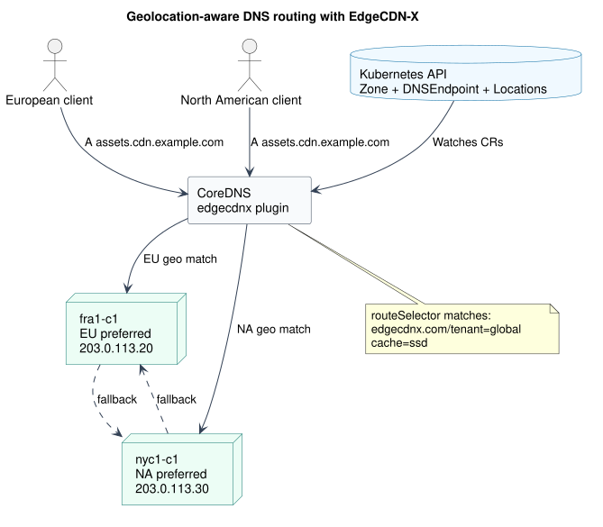

DNS configuration often lives outside the platform it serves. Application teams define workloads in Kubernetes, then switch tools and workflows to create records, route users, and manage failover. EdgeCDN-X brings those decisions into Kubernetes through its [CoreDNS plugin](https://github.com/EdgeCDN-X/edgecdnx-plugin) and custom resources.

The result is a declarative DNS layer that can provide fixed answers or route requests across edge locations using client prefixes, geolocation, and node health.

## Configure the CoreDNS plugin

The `edgecdnx` plugin watches `DNSEndpoint`, `Location`, `PrefixList`, and `Zone` resources in a configured Kubernetes namespace. Add it to the CoreDNS Corefile alongside the standard health, metrics, forwarding, and cache plugins:

```text
.:53 {
  errors
  health
  ready

  edgecdnx . {
    namespace edgecdnx
    soa ns1
    ns ns1.edge.example.com. 203.0.113.10
    ns ns2.edge.example.com. 203.0.113.11
    recordttl 60
    dnsresponsetype A_AAAA
    grpcresponsetype CNAME
  }

  prometheus :9153
  forward . 1.1.1.1 8.8.8.8
  cache 30
  reload
}
```

`namespace` tells the plugin where to watch for EdgeCDN-X resources. The `soa` and repeatable `ns` directives provide authoritative zone data. Dynamic requests return node addresses by default, while `grpcresponsetype CNAME` selects CNAME responses for requests carrying gRPC metadata.

CoreDNS also needs Kubernetes credentials and RBAC permission to read the four resource types. The plugin reports ready only after its required Kubernetes informers have synchronized, so the standard `ready` plugin can keep traffic away during startup.

## Define a fixed DNS record

A `Simple` `DNSEndpoint` returns the targets declared in the resource. This is useful for an origin, load balancer, or another address that does not need location selection:

```yaml
apiVersion: infrastructure.edgecdnx.com/v1alpha1
kind: DNSEndpoint
metadata:
  name: static-origin
  namespace: edgecdnx
spec:
  dnsName: static.example.com
  routingPolicy: Simple
  recordType: A
  recordTTL: 300
  targets:
    - 203.0.113.20
```

Apply the resource with `kubectl apply -f static-origin.yaml`. CoreDNS observes the change through its Kubernetes informer and can answer `A` queries for `static.example.com` without maintaining a separate zone file.

## Use case: route European and North American users locally

Consider an asset hostname served from Frankfurt and New York. European requests should prefer `fra1-c1`, North American requests should prefer `nyc1-c1`, and either location should take over if the other has no healthy nodes.



First, declare the authoritative zone. The contact uses the DNS SOA dot notation required by the `Zone` CRD:

```yaml
apiVersion: infrastructure.edgecdnx.com/v1alpha1
kind: Zone
metadata:
  name: cdn.example.com
  namespace: edgecdnx
spec:
  zone: cdn.example.com
  email: noc.cdn.example.com.
```

Next, create two locations:

```yaml
apiVersion: infrastructure.edgecdnx.com/v1alpha1
kind: Location
metadata:
  name: fra1-c1
  namespace: edgecdnx
  labels:
    edgecdnx.com/tenant: global
spec:
  fallbackLocations:
    - nyc1-c1
  geoLookup:
    weight: 50
    attributes:
      geoip/continent/code:
        weight: 1000
        values:
          - value: EU
          - value: NA
            weight: -900
  nodeGroups:
    - name: ssd
      flavor: ""
      labels:
        cache: ssd
      nodes:
        - name: n1
          ipv4: 203.0.113.20
---
apiVersion: infrastructure.edgecdnx.com/v1alpha1
kind: Location
metadata:
  name: nyc1-c1
  namespace: edgecdnx
  labels:
    edgecdnx.com/tenant: global
spec:
  fallbackLocations:
    - fra1-c1
  geoLookup:
    weight: 50
    attributes:
      geoip/continent/code:
        weight: 1000
        values:
          - value: NA
          - value: EU
            weight: -900
  nodeGroups:
    - name: ssd
      flavor: ""
      labels:
        cache: ssd
      nodes:
        - name: n1
          ipv4: 203.0.113.30
```

Finally, define the DNS entry. EdgeCDN-X evaluates the selector against the location labels merged with each node group's labels. Both locations above therefore match both selector terms: `edgecdnx.com/tenant: global` from `metadata.labels` and `cache: ssd` from `spec.nodeGroups[].labels`.

```yaml
apiVersion: infrastructure.edgecdnx.com/v1alpha1
kind: DNSEndpoint
metadata:
  name: cdn-assets
  namespace: edgecdnx
spec:
  dnsName: assets.cdn.example.com
  routingPolicy: Geolocation
  recordType: A
  recordTTL: 60
  routeSelector:
    matchLabels:
      edgecdnx.com/tenant: global
      cache: ssd
```

When a query arrives, the plugin first checks `PrefixList` resources for an explicit source-network match. Without one, the GeoIP continent metadata drives location scoring: `EU` favors Frankfurt and `NA` favors New York. The plugin then selects a healthy matching node. Maintenance state, health conditions, and active alerts can remove candidates; the reciprocal `fallbackLocations` entries provide the alternate region when needed.

Apply the resources after the CRDs, plugin RBAC, and health reporting are installed. This keeps DNS entries, routing intent, and operational state in the same Kubernetes workflow. Review the complete [EdgeCDN-X DNS guide](https://edgecdn-x.github.io/coredns) and the [CRD specification](https://doc.crds.dev/github.com/EdgeCDN-X/edgecdnx-controller) before adapting the example to your domains and addresses.