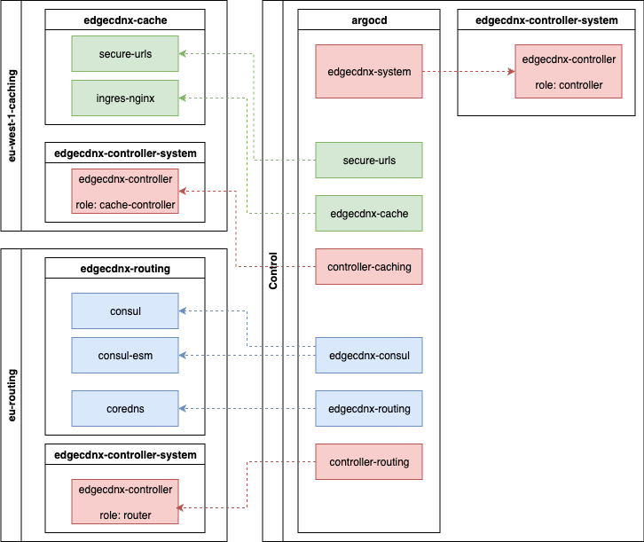

---
tags:
  - routing
  - caching
  - secure-urls
  - consul
  - ingress-nginx
---
# Core Components
Once we have the locations registered and annotated with the correct annotations we can start deploying the control plane components across the whole ecosystem.

The image below represents the core components deployed. All these components are deployed with ArgoCD using Cluster Generators.

## Control Plane
#### EdgeCDN-X-Controller - Control
The control plane runs the `edgecdnx-controller`, which is responsible for orchestrating the configured resources. Further, the control plane must have `cert-manager` installed for SSL Certificate issuance.

## Routing
#### CoreDNS
Routing nodes serve CoreDNS with our custom implementation which can listen to CRD changes. CoreDNS will automatically update it's database watching the kubernetes API, so there's no need to reload on reconfiguration. 
#### Consul
To enable healthchecks towards the caching locations `Consul` with `Consul ESM` is used. `Consul` is only used to register the endpoints and `Consul ESM`.
#### EdgeCDN-X-Controller - Routing
Routing clusters also run the `edgecdnx-controller`, but in `routing` role. This controller is responsible for registering the services to Consul for healthchecks.

## Caching
#### Ingress Nginx
Caching locations run `ingress-nginx` controller with custom configuration and annotations to enable caching on local storages. It is ideally deployed as a Daemonset with HostNetworking enabled to reduce the networking overhead as much as possible. The nodes are ideally available without a LoadBalancer in front of it as individual Nodes. If such setup is not possible a LoadBalancer can be placed in front of it.
#### Secure URLs
The secure URLs component is responsible for exposing private data via the CDN by signing the URLs. It also can be used for streaming HLS or MPEG Content and the stream can be secured with a session cookie.
#### EdgeCDN-X-Controller - Caching
The edgeCDN-X Controller on these clusters are running in `caching` role. The controller is responsible for generating ingress, service and s3 gateway components based on the Service configuration.
