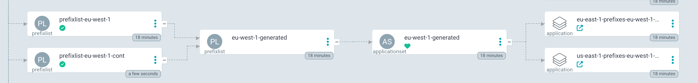

---
tags:
  - edgecdnx-controller
  - helm
---
# EdgeCDN-X Controller
This controller is responsible for the orchestration of the resources across all the EdgeCDN-X Platform. The controller is built on top of CRDs and the Reconcile Loop ensures that the required services are always up to date in each region. ArgoCD Appliactionsets are used for remote deployments to each region.

## Role
The controller can run in several modes. For the control plane it is required to run the controller in role `controller`, which is the default.
Additonal roles such ash `cache-controller` and `router` alter the behaviour of the Reconcile loop and they should be used elsewhere.


## CRDs
There are 3 CRDs in the system:

* Location
* Service
* PrefixList

Locations define the infrastructure. Services define the services served across the plaftom, and PrefixLists can alter the routing in the ecosystem. For details click [here](crds.md)

# Functionality
In `controller` mode the controller listens for any changes to these CRDs. If a CRDs is created, updated or deleted it is ensured that the resource is also distributed to the required regions. This is achieved by generating an Applicationset based on the CRD. The applicationset is using a simple [resoure-thrower](https://github.com/EdgeCDN-X/helm-charts/tree/main/charts/resource-thrower) Helm-chart, which simply takes a list of resources which are then rolled out on the target endpoints.

* Location - these are distributed to routing locations. Clusters set with **edgecdnx.com/routing** annotation for CoreDNS
* PrefixList - these are distributed to routing locations. Clusters set with **edgecdnx.com/routing** annotation for CoreDNS
* Service - these are distributed to both routing and caching locations. Clusters set with **edgecdnx.com/routing** or **edgecdnx.com/caching** annotation. Both CoreDNS and Nginx are working with these types.

## Route consolidation
To ensure that there are no overlapping IPv4 or IPv6 addresses in the PrefixLists, the EdgeCDN-X Controller consolidates and merges subnets into supernets to make the routing table smaller.



# Deployment
Deploy the EdgeCDN-X Controller locally on the control plane with helm.

Current up to date Helm chart is:
```yaml
apiVersion: v2
name: edgecdnx-controller
description: A Helm chart for Kubernetes
type: application
version: 0.0.0
dependencies:
  - name: edgecdnx-controller
    version: 0.5.4
    repository: https://edgecdn-x.github.io/helm-charts/
```

And values files:
```yaml
edgecdnx-controller:
  targetNamespace: "edgecdnx"
```

[CRDs](crds.md) are deployed alongside this helm deployment.