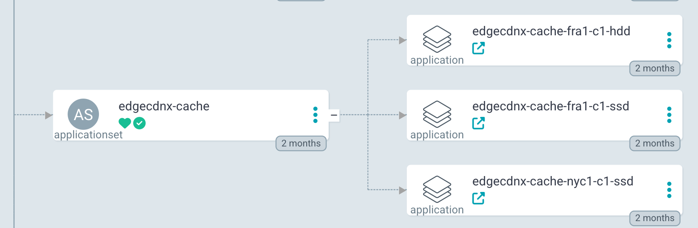

---
tags:
  - nginx
  - cache
---

# Ingress Nginx
Ingress Nginx is used as it is and customized with configuration options. Deploy the NGINX with a helm chart. The upstream helm chart just works perfect. Ingress Nginx is extensible with custom snippets. If you wan't to use a cluster with mixed caches (e.g. SSD, HDD, TMPFS etc) you will have to deploy multiple instances of the ingres-nginx helm chart.

**Configuration**:

* deploy the ingress as a Daemonset
* mount the cache storage as a hostPath
* specify your `ingressClass`
* set the `nodeSelector`
* specify `cache` configuration with an extra `http-snippet`


## Dynamic Coniguration example

On our deployment we use an [ArgoCD Plugin Generator](https://github.com/EdgeCDN-X/argocd-locations-plugin-generator), which will generate a Helm deployment for each NodeGroup defined in a location for a specific Cluster. For this generator to work you have to set the following labels on the Cluster secret metadata:

```yaml
# Cluster secret spec in ArgoCD
apiVersion: v1
data:
  ...omitted
kind: Secret
metadata:
  annotations:
    basedomain: demo.edgecdnx.com
    cert_manager_email: tbo@tbotech.sk
    edgecdnx.com/cache-spec-namespace: argocd           #    -> points to Location Spec
    edgecdnx.com/cache-spec-resource: fra1-c1           #    -> points to Location Spec
  name: cluster-fra1-c1
  namespace: argocd
type: Opaque

---
# Location argocd/fra1-c1
apiVersion: infrastructure.edgecdnx.com/v1alpha1
kind: Location
metadata:
  name: fra1-c1
  namespace: argocd
spec:
  nodeGroups:
  - cacheConfig:
      inactive: 10080m
      keysZone: 100m
      maxSize: 4096m
      name: ssd
      path: /var/cache/ssd
    name: ssd
    nodeSelector:
      kubernetes.civo.com/civo-node-pool: fra1-c1
    nodes:
    - ipv4: 74.220.31.183
      name: n1
  - cacheConfig:
      inactive: 10080m
      keysZone: 100m
      maxSize: 4096m
      name: hdd
      path: /var/cache/hdd
    name: hdd
    nodeSelector:
      kubernetes.civo.com/civo-node-pool: fra1-hdd1
    nodes:
    - ipv4: 74.220.31.22
      name: n2
```


These 2 manifests in combination with a Matrix generator and the plugin generator will generate 2 instances if ingress-nginx on cluster fra1-c1 since there are 2 nodeGroups defined. Each of the instances will have a nodeSelector and Cache Configuration set.

Such an applicationSet can be defined as:

```yaml
apiVersion: argoproj.io/v1alpha1
kind: ApplicationSet
metadata:
  name: edgecdnx-cache
spec:
  goTemplate: true
  goTemplateOptions: ["missingkey=error"]
  generators:
    - matrix:
        generators:
          - clusters:
              values:
                chart: ingress-nginx
                chartVersion: 4.12.1
                chartRepository: https://kubernetes.github.io/ingress-nginx
                namespace: edgecdnx-cache
              selector:
                matchExpressions:
                  - key: edgecdnx.com/caching
                    operator: In
                    values:
                      - "true"
                      - "yes"
          - plugin:
              configMapRef:
                name: argocd-locations-plugin-generator
              input:
                parameters:
                  name: '{{ index .metadata.annotations "edgecdnx.com/cache-spec-resource" }}'
                  namespace: '{{ index .metadata.annotations "edgecdnx.com/cache-spec-namespace" }}'
  template:
    metadata:
      name: "edgecdnx-cache-{{ .name }}-{{ .cacheName }}"
    spec:
      project: default
      sources:
        - chart: "{{ .values.chart }}"
          repoURL: "{{ .values.chartRepository }}"
          targetRevision: "{{ .values.chartVersion }}"
          helm:
            releaseName: edgecdnx-cache-{{ .cacheName }}
            ignoreMissingValueFiles: true
            values: |
              controller:
                metrics:
                  enabled: true
                  serviceMonitor:
                    enabled: true
                    additionalLabels:
                      release: edgecdnx-monitoring
                allowSnippetAnnotations: true
                ingressClass: {{ .cacheName }}
                ingressClassResource:
                  enabled: true
                  default: false
                  name: {{ .cacheName }}
                  controllerValue: "edgecdnx.com/{{ .cacheName }}"
                {{- with .nodeSelector }}
                nodeSelector:
                  {{- toYaml . | nindent 4 }}
                {{- end }}
                service:
                  enabled: true
                hostPort:
                  enabled: false
                kind: DaemonSet
                extraVolumes:
                  - name: cache-{{ .cacheName }}
                    hostPath:
                      path: "{{ .path }}"
                      type: DirectoryOrCreate
                extraVolumeMounts:
                - name: cache-{{ .cacheName }}
                  mountPath: "{{ .path }}"
                extraInitContainers:
                  - name: init-cache-dirs
                    image: busybox:1.34
                    command: ["/bin/sh", "-c"]
                    args:
                      - "mkdir -p {{ .path }} && chmod 777 {{ .path }};"
                    volumeMounts:
                      - name: cache-{{ .cacheName }}
                        mountPath: "{{ .path }}"
                config:
                  proxy-buffering: "on"
                  annotations-risk-level: "Critical"
                  enable-modsecurity: "true"
                  http-snippet: |
                    # Cache configuration for {{ .cacheName }}
                    proxy_cache_path {{ .path }} levels=1:2 keys_zone={{ .cacheName }}:{{ .keysZone }} inactive={{ .inactive }} use_temp_path=off max_size={{ .maxSize }};
                  log-format-upstream: |-
                    {"time": "$time_iso8601", "v": "1", "remote_addr": "$proxy_protocol_addr", "request_id": "$req_id", "bytes_sent": $bytes_sent, "request_time": $request_time, "status": $status, "vhost": "$host", "request_proto": "$server_protocol", "path": "$uri", "request_length": $request_length, "method": "$request_method", "http_user_agent": "$http_user_agent", "upstream_bytes": "$upstream_response_length", "upstream_response_time": "$upstream_response_time" }
      destination:
        namespace: "{{ .values.namespace }}"
        server: "{{ .server }}"
      syncPolicy:
        automated:
          selfHeal: true
        syncOptions:
          - CreateNamespace=true
          - ServerSideApply=true # Big CRDs.
      ignoreDifferences: []
```

## Resuling Applications



For this Applicationset to work, you have to deploy the ArgoCD Plugin Generator. Refer to the [Docs](https://argo-cd.readthedocs.io/en/latest/operator-manual/applicationset/Generators-Plugin/).