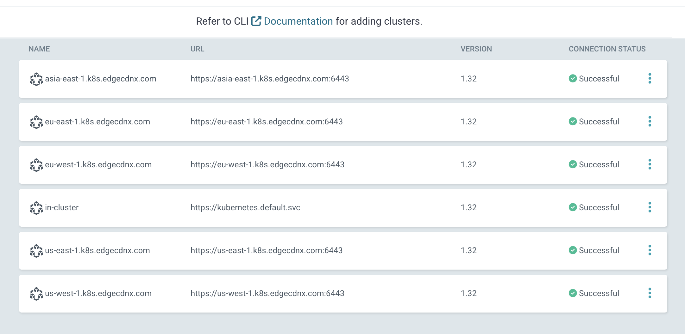

# Registering Locations

Once we have ArgoCD in place, we can start registering locations to ArgoCD. Please note, that each k8s installation or hosted solutions might be slightly different. In this document we're describing how to register a location for vanilla K8S based installations.


## Preparing destination clusters
The destionation cluster must be accessible from the control-plane cluster.

Start by preparing the namespace, service account and token on the destination cluster. you can use the following Ansible Tasks:

```yaml
- name: Synchronizes ArgoCD variables and cluster definitions
  hosts: edgecdnx-cache,edgecdnx-routing,edgecdnx-control
  become: true

  tasks:
    - name: Make sure we have pip installed
      package:
        name: python3-pip
        state: present

    - name: Make sure we have kubernetes client installed 
      pip:
        name: kubernetes
        state: present

    - name: "Create ArgoCD Namespace"
      k8s:
        state: present
        definition:
          apiVersion: v1
          kind: Namespace
          metadata:
            name: argocd
    
    - name: "Create Service Account with Admin Rights"
      k8s:
        state: present
        definition:
          apiVersion: v1
          kind: ServiceAccount
          metadata:
            name: argocd-manager
            namespace: argocd
      when: inventory_hostname != 'control.k8s.edgecdnx.com'


    - name: "Create Cluster Role Binding for Service Account"
      k8s:
        state: present
        definition:
          apiVersion: rbac.authorization.k8s.io/v1
          kind: ClusterRoleBinding
          metadata:
            name: argocd-manager-binding
          subjects:
            - kind: ServiceAccount
              name: argocd-manager
              namespace: argocd
          roleRef:
            kind: ClusterRole
            name: cluster-admin
            apiGroup: rbac.authorization.k8s.io
      when: inventory_hostname != 'control.k8s.edgecdnx.com'


    - name: "Create Bearer Token for Service Account"
      k8s:
        state: present
        definition:
          apiVersion: v1
          kind: Secret
          metadata:
            name: argocd-manager-token
            namespace: argocd
            annotations:
              kubernetes.io/service-account.name: argocd-manager
          type: kubernetes.io/service-account-token
      when: inventory_hostname != 'control.k8s.edgecdnx.com'


    - name: "Get the CA from the token"
      k8s_info:
        kind: Secret
        namespace: argocd
        name: argocd-manager-token
      register: token_secret
      when: inventory_hostname != 'control.k8s.edgecdnx.com'


    - name: "build tlsClientConfig"
      set_fact:
        clusterConfig:
          bearerToken: "{{ token_secret.resources[0].data['token'] | b64decode }}"
          tlsClientConfig:
            caData: "{{ token_secret.resources[0].data['ca.crt'] }}"
            serverName: "{{ inventory_hostname }}"
      when: inventory_hostname != 'control.k8s.edgecdnx.com'        
```

These tasks populate the `clusterConfig` variable for the control plane. Once we have the necessary fields, create secrets with the required metadata.

### Routing Cluster
For **Routing** clusters create a secret with these parameters:
```yaml
    - name: "Register Cluster Config in ArgoCD - Routing"
      k8s:
        state: present
        force: true
        definition:
          apiVersion: v1
          kind: Secret
          metadata:
            name: cluster-{{ inventory_hostname }}
            namespace: argocd
            labels:
              argocd.argoproj.io/secret-type: cluster
              edgecdnx.com/location: "{{ location }}"
              edgecdnx.com/routing: "true"
            annotations:
              edgecdnx.com/public-ip: "{{ public_ip }}"
              edgecdnx.com/ns: "{{ ns }}"
              edgecdnx.com/namespace: "{{ namespace }}"
              edgecdnx.com/basedomain: "{{ basedomain }}"
              edgecdnx.com/domainemail: "{{ domainemail }}"
          type: Opaque
          stringData:
            name: "{{ inventory_hostname }}"
            server: "https://{{ inventory_hostname }}:6443"
            config: "{{ clusterConfig | to_nice_json }}"
      delegate_to: control.k8s.edgecdnx.com
      when: inventory_hostname in groups['edgecdnx-routing']
```
**Labels**

* argocd.argoproj.io/secret-type - ArgoCD Specific - required
* edgecdnx.com/location - Defines the location name - e.g. eu-west-1
* edgecdnx.com/routing - (true/false) - set to true if the location is responsible for routing

**Annotations**

* edgecdnx.com/public-ip - Sets the public IP of the DNS endpoint 
* edgecdnx.com/ns - ns id for the location. E.g. for "1" it becomes ns1.

### Caching Cluter
For **Caching** clusters create a secet with these parameters:
```yaml
    - name: "Register Cluster Config in ArgoCD - Caching"
      k8s:
        state: present
        force: true
        definition:
          apiVersion: v1
          kind: Secret
          metadata:
            name: cluster-{{ inventory_hostname }}
            namespace: argocd
            labels:
              argocd.argoproj.io/secret-type: cluster
              edgecdnx.com/location: "{{ location }}"
              edgecdnx.com/caching: "true"
              edgecdnx.com/tier: "{{ tier }}"
            annotations: {}
          type: Opaque
          stringData:
            name: "{{ inventory_hostname }}"
            server: "https://{{ inventory_hostname }}:6443"
            config: "{{ clusterConfig | to_nice_json }}"
      delegate_to: control.k8s.edgecdnx.com
      when: inventory_hostname in groups['edgecdnx-cache']
```

**Labels**

* argocd.argoproj.io/secret-type - ArgoCD Specific - required
* edgecdnx.com/location - Defines the location name - e.g. eu-west-1
* edgecdnx.com/caching - (true/false) - set to true if the location is responsible for caching
* edgecdnx.com/tier - tier name - currenly unused, reserved for future use


### Inventory
Here's an exmaple inventory how this could look for you

```yaml
edgecdnx-control:
  hosts:
    control.k8s.edgecdnx.com:
edgecdnx:
  children:
    edgecdnx-routing:
    edgecdnx-cache:
edgecdnx-routing:
  hosts:
    eu-east-1.k8s.edgecdnx.com:
      location: eu-east-1
      ns: "1"
      public_ip: "11.12.13.14"
      namespace: edgecdnx
      basedomain: cdn.edgecdnx.com.
      domainemail: noc.edgecdnx.com
    us-east-1.k8s.edgecdnx.com:
      location: us-east-1
      ns: "2"
      public_ip: "150.151.152.153"
      namespace: edgecdnx
      basedomain: cdn.edgecdnx.com.
      domainemail: noc.edgecdnx.com
edgecdnx-cache:
  hosts:
    eu-west-1.k8s.edgecdnx.com:
      location: eu-west-1
    us-west-1.k8s.edgecdnx.com:
      location: us-west-1
    asia-east-1.k8s.edgecdnx.com:
      location: asia-east-1
  vars:
    tier: edge
```

## Verification
If successfully registered you should see the clusters registered in ArgoCD on your Control Plane



This process is also possible with ArgoCD CLI. Refer to the docs of ArgoCD for registering [clusters](https://argo-cd.readthedocs.io/en/stable/getting_started/#5-register-a-cluster-to-deploy-apps-to-optional)