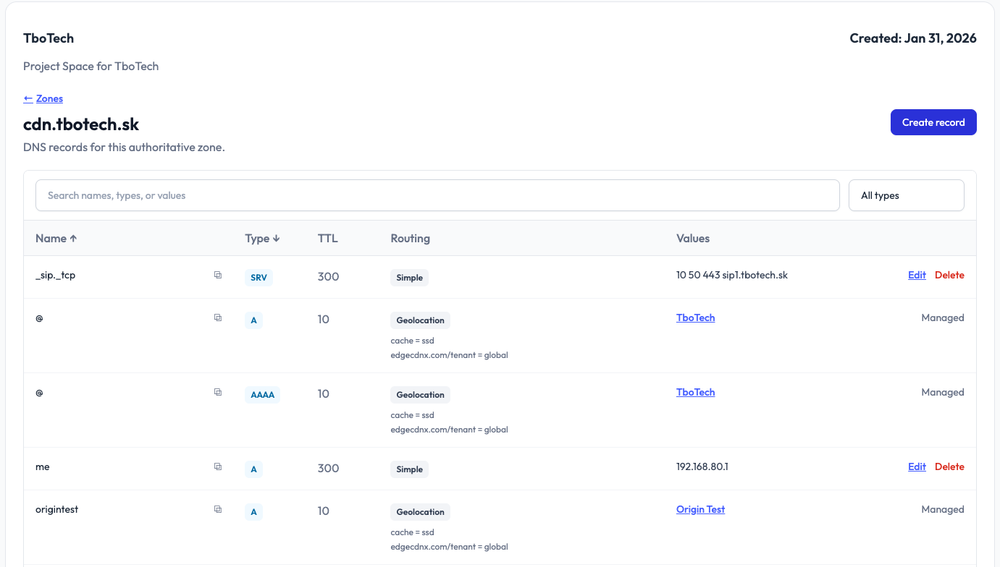

**Building the DNS Platform You've Always Wanted**

EdgeCDN-X is evolving into a full-fledged **Global Server Load Balancer (GSLB)** platform, powered by CoreDNS and backed by Kubernetes-native routing intelligence.

**What makes our DNS platform different?**

✓ **Intelligent Routing** — Smart location selection based on client IP prefixes, geolocation, and real-time health status  
✓ **Declarative CRDs** — Define your routing logic with Kubernetes-native Location, DNSEndpoint, and PrefixList resources  
✓ **Health-Aware Failover** — Automatic fallback to secondary locations when primary nodes are degraded  
✓ **Zero-Downtime Updates** — Dynamic reconfiguration without DNS restarts  

Currently, many teams rely on AWS Route 53, Cloudflare, or other proprietary solutions for global DNS and load balancing. While they work, they come with vendor lock-in and complexity.

**We're building an open-source alternative that puts you in control.**

---

**What's your current DNS/routing solution?**

Are you using Route 53, Azure Traffic Manager, Cloudflare, traditional round-robin DNS, or rolling your own? Drop a comment—we'd love to hear about your setup and pain points!

*Read more about EdgeCDN-X DNS routing on our [Blog](https://edgecdnx.com/blog/global-server-load-balancing-now-in-your-hands-find-out-how)*

## Social Media Copy

### LinkedIn

```text
EdgeCDN-X is evolving into a full-fledged DNS with Global Server Load Balancer (GSLB) features, powered by CoreDNS and Kubernetes-native routing.

What makes it different?
✓ Intelligent routing by IP prefix, geolocation, health status and custom Prometheus metrics
✓ Declarative CRDs (Location, DNSEndpoint, PrefixList)
✓ Health-aware failover
✓ Zero-downtime updates

Tired of vendor lock-in with Route 53 or Cloudflare? We're building an open-source alternative that puts you in control.

What's your current DNS/routing setup? Let us know in the comments.

Read more: https://edgecdnx.com/blog/global-server-load-balancing-now-in-your-hands-find-out-how

#DNS #GSLB #Kubernetes #OpenSource #EdgeComputing
```

### X (Twitter)

```text
EdgeCDN-X is becoming a full GSLB platform on CoreDNS + Kubernetes: smart IP/geo routing, declarative CRDs, health-aware failover, metrics-aware routing, zero-downtime updates. An open-source alternative to Route 53/Cloudflare lock-in. What's your DNS setup?

https://edgecdnx.com/blog/global-server-load-balancing-now-in-your-hands-find-out-how
```

## Schedule

Click a link below to open the composer prefilled with this post's copy, or use the calendar link to pick your own posting date/time (edit the date in the calendar popup before saving).

| Platform | Post Now | Add to Calendar |
| --- | --- | --- |
| X | [Open X composer](https://twitter.com/intent/tweet?text=EdgeCDN-X%20is%20becoming%20a%20full%20GSLB%20platform%20on%20CoreDNS%20%2B%20Kubernetes%3A%20smart%20IP%2Fgeo%20routing%2C%20declarative%20CRDs%2C%20health-aware%20failover%2C%20zero-downtime%20updates.%20An%20open-source%20alternative%20to%20Route%2053%2FCloudflare%20lock-in.%20What%27s%20your%20DNS%20setup%3F%0A%0Ahttps%3A%2F%2Fedgecdnx.com%2Fblog%2Fglobal-server-load-balancing-now-in-your-hands-find-out-how) | [Add X post reminder](https://www.google.com/calendar/render?action=TEMPLATE&text=Post%20to%20X%3A%20EdgeCDN-X%20DNS%20Platform&dates=20260915T090000Z%2F20260915T091500Z&details=EdgeCDN-X%20is%20becoming%20a%20full%20GSLB%20platform%20on%20CoreDNS%20%2B%20Kubernetes%3A%20smart%20IP%2Fgeo%20routing%2C%20declarative%20CRDs%2C%20health-aware%20failover%2C%20zero-downtime%20updates.%20An%20open-source%20alternative%20to%20Route%2053%2FCloudflare%20lock-in.%20What%27s%20your%20DNS%20setup%3F%0A%0Ahttps%3A%2F%2Fedgecdnx.com%2Fblog%2Fglobal-server-load-balancing-now-in-your-hands-find-out-how&ctz=Europe%2FBerlin) |
| LinkedIn | [Open LinkedIn composer](https://www.linkedin.com/feed/?shareActive=true&text=EdgeCDN-X%20is%20evolving%20into%20a%20full-fledged%20Global%20Server%20Load%20Balancer%20%28GSLB%29%20platform%2C%20powered%20by%20CoreDNS%20and%20Kubernetes-native%20routing.%0A%0AWhat%20makes%20it%20different%3F%0A%E2%9C%93%20Intelligent%20routing%20by%20IP%20prefix%2C%20geolocation%20%26%20health%20status%0A%E2%9C%93%20Declarative%20CRDs%20%28Location%2C%20DNSEndpoint%2C%20PrefixList%29%0A%E2%9C%93%20Health-aware%20failover%0A%E2%9C%93%20Zero-downtime%20updates%0A%0ATired%20of%20vendor%20lock-in%20with%20Route%2053%20or%20Cloudflare%3F%20We%27re%20building%20an%20open-source%20alternative%20that%20puts%20you%20in%20control.%0A%0AWhat%27s%20your%20current%20DNS%2Frouting%20setup%3F%20Let%20us%20know%20in%20the%20comments.%0A%0ARead%20more%3A%20https%3A%2F%2Fedgecdnx.com%2Fblog%2Fglobal-server-load-balancing-now-in-your-hands-find-out-how%0A%0A%23DNS%20%23GSLB%20%23Kubernetes%20%23OpenSource%20%23EdgeComputing) | [Add LinkedIn post reminder](https://www.google.com/calendar/render?action=TEMPLATE&text=Post%20to%20LinkedIn%3A%20EdgeCDN-X%20DNS%20Platform&dates=20260915T070000Z%2F20260915T073000Z&details=EdgeCDN-X%20is%20evolving%20into%20a%20full-fledged%20Global%20Server%20Load%20Balancer%20%28GSLB%29%20platform%2C%20powered%20by%20CoreDNS%20and%20Kubernetes-native%20routing.%0A%0AWhat%20makes%20it%20different%3F%0A%E2%9C%93%20Intelligent%20routing%20by%20IP%20prefix%2C%20geolocation%20%26%20health%20status%0A%E2%9C%93%20Declarative%20CRDs%20%28Location%2C%20DNSEndpoint%2C%20PrefixList%29%0A%E2%9C%93%20Health-aware%20failover%0A%E2%9C%93%20Zero-downtime%20updates%0A%0ATired%20of%20vendor%20lock-in%20with%20Route%2053%20or%20Cloudflare%3F%20We%27re%20building%20an%20open-source%20alternative%20that%20puts%20you%20in%20control.%0A%0AWhat%27s%20your%20current%20DNS%2Frouting%20setup%3F%20Let%20us%20know%20in%20the%20comments.%0A%0ARead%20more%3A%20https%3A%2F%2Fedgecdnx.com%2Fblog%2Fglobal-server-load-balancing-now-in-your-hands-find-out-how%0A%0A%23DNS%20%23GSLB%20%23Kubernetes%20%23OpenSource%20%23EdgeComputing&ctz=Europe%2FBerlin) |

*Note: X's intent link opens a pre-filled tweet composer for immediate posting (X doesn't support scheduling via URL). LinkedIn's prefill parameter is unofficial and may not always populate the text box — if it doesn't, use the copy block above. "Add to Calendar" links default to CET/CEST (Europe/Berlin) and create a reminder event with the post copy in the description; they don't auto-publish.*

